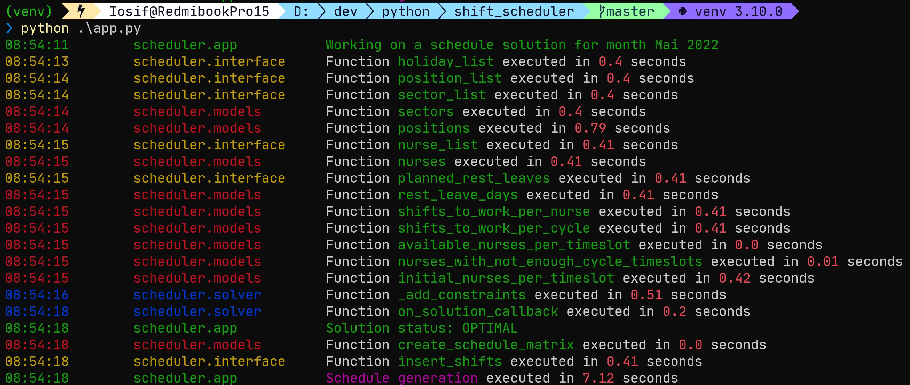

# Shift Scheduler 

A personal project for generating the monthly schedule for nurses at the Emergency Department in Cluj-Napoca using  Google's OR-Tools CP-SAT Solver. 

## :dart: Motivation

Creating the monthly schedule for 80+ nurses with only pen & paper when you have into account a multitude of constraints like:

- **exact number of shifts needed for each nurse**
- **minimum number of nurses needed per timeslot**
- **nurses with different abilities/skills** - not all nurses can work on all positions in the department
- **4-day shift plan** (*12/24/12/48*) - employees work in shifts of 12 hours; first a *day shift*, followed by 24 rest hours, then a *night shift* , finishing with 48 rest hours. Each nurse is part of a team or cycle and should only (preferably) be assign shifts on the corresponding cycle.
- **planned rest leave days**
- **fair shift allocation**
- **nurse requests**

is a tiresome and time-consuming task. A computer can do that job in matter of seconds if given the right instructions.

## :floppy_disk: Project Files Description

The project is grouped in 3 main files:

#### <u>*interface.py*</u> 

This file contains only the class **ScheduleSSManager**, responsible with:

  - collecting input data for the model from Google Sheets

  - generating new spreadsheet file for the working month

  - inserting output data (generated schedule) in the new spreadsheet

  - insert the link of the newly created spreadsheet in another centralizer spreadsheet   

    

#### <u>*models.py*</u>

This module is responsible for modeling and abstraction of the key concepts involved in generating the schedule:

 - **Month**
 - **TimeSlot**
 - **Sector**
 - **Position**
 - **Nurse**
 - **Shift**

The **Schedule** class is a utility class that only gets instantiated once and contains all data modelled with previous classes and methods and algorithms for pre-processing data that will be passed to the solver. I extensively used @cached_property from functools with the result of increasing the project execution ~10X.

####  <u>*solver.py*</u>

The **ScheduleModel** class extends cp_model.CpModel and contains methods for adding the variables and constraints to the model that will be passed to the solver.

The **SolutionCollector** class extends cp_model.CpSolverSolutionCallback and it's only role is to save the solution to a convenient data structure.

The file **utils.py** contains at the moment the class decorator class **TimerLog** used for conveniently logging time execution of different functions/methods in the project. 

##  :information_source: Usage

The project cannot be properly run without the input data that cannot be shared here, but can be used as inspiration for other projects. 

## :wrench: Built with

This project makes use of

- [Python 3](https://www.python.org/downloads/)
- [Google OR-tools CP-SAT solver](https://developers.google.com/optimization/cp/cp_solver)
- [pygsheets](https://github.com/nithinmurali/pygsheets)
- [pydrive2](https://github.com/iterative/PyDrive2)

